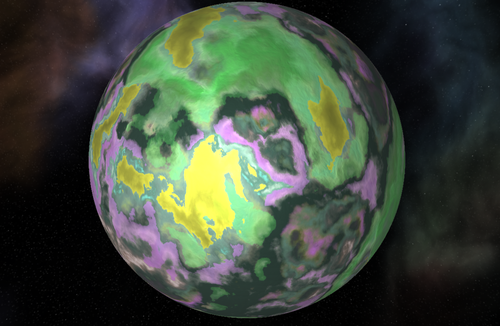
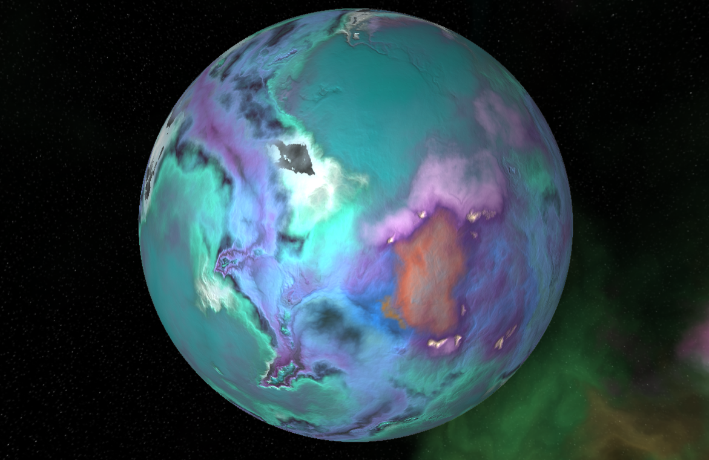

Procedural Planets in WebGL using three.js

[Live Demo](http://colordodge.com/ProceduralPlanet)

[Gallery](https://imgur.com/a/OwfIwj4)

## How to install

* Run `npm install`
* Run `npm run dev`
* Open http://localhost:8080

